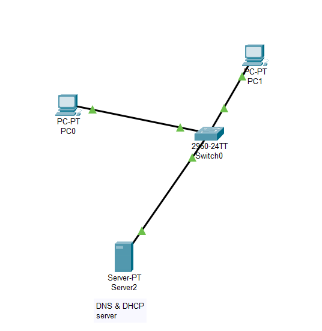

# Week 2: Communication Protocols & Packet Analysis

> 📅 **Goal:** Deepen your understanding of how devices communicate inside a network. Learn key protocols like TCP, UDP, DNS, DHCP, and inspect real packets using Wireshark.

---

## 🔑 Topics Covered

| Concept | Focus |
|--------|-------|
| **TCP vs UDP** | Reliability vs speed, real-world use cases |
| **DNS** | Domain resolution process |
| **DHCP** | Automatic IP assignment (DORA process) |
| **Ping & Traceroute** | Basic network testing tools |
| **MAC vs IP** | Layer 2 vs Layer 3 addressing |

---

## 🧰 Tools Used

- 🧪 **Wireshark** — Packet inspection
- 🛠 **Cisco Packet Tracer** — Protocol simulation
- 💻 **Command Prompt** — `ping`, `tracert`, `arp`, `ipconfig`

---

## 🗂️ Lab Files

- 🧩 Packet Tracer: [DNS_and_DHCP.pkt](./packet-tracer/DNS and DHCP.pkt)
- 🖼️ Topology Diagram: 

---

## 📘 Day-by-Day Breakdown

### 📖 Day 1 – TCP vs UDP

- Watched: [TCP vs UDP – Computerphile](https://www.youtube.com/watch?v=Vdc8TCESIg8)
- Documented use cases and differences
- Compared headers, handshake, sequencing, and flow control

📄 **TCP/UDP Comparison Table:**

| Feature | TCP | UDP |
|--------|-----|-----|
| Connection | ✅ Yes | ❌ No |
| Reliability | ✅ Yes | ❌ No |
| Ordered | ✅ Yes | ❌ No |
| Use Case | HTTP, FTP, Email | VoIP, DNS, Streaming |
| Speed | Slower | Faster |

---

### 📖 Day 2 – DNS & DHCP Protocols

- Watched: [How DNS Works](https://www.youtube.com/watch?v=72snZctFFtA) and [How DHCP Works](https://www.youtube.com/watch?v=ho7gTQvmcvM)
- Simulated both protocols in Packet Tracer

📦 **DNS Observation:**
- Querying `example.com` returned `192.168.1.250`

📦 **DHCP Observation:**
- IP Assigned: `192.168.1.101`
- Subnet: `255.255.255.0`
- Gateway: `192.168.1.1`
- DNS: `192.168.1.200`

---

### 🧪 Day 3 – Packet Tracer Lab: DNS & DHCP

- Built a network with:
  - 2 PCs, 1 Router, 1 DNS Server, 1 DHCP Server
- Successfully tested:
  - Automatic IP assignment
  - DNS name resolution using `ping cisco.com`

---

### 🧪 Day 4 – Wireshark Analysis

Observed three things:

1. **DNS Queries**:
   - A, AAAA, and PTR lookups
   - TTL, name server resolution

2. **DHCP DORA Process**:
   - Discover → Offer → Request → ACK
   - Used `ipconfig /release` and `/renew` with `bootp` filter

3. **HTTP Traffic (Port 80)**:
   - Captured 3-way TCP handshake (SYN, SYN-ACK, ACK)
   - Observed HTTP GET and 200 OK response

---

### 🧪 Day 5 – Ping, Traceroute, ARP

- `ping 8.8.8.8` vs `ping google.com` → DNS delay observed
- `tracert` revealed router hops
- `arp -a` showed MAC addresses for known IPs

---

### 📅 Day 6 – Recap & Review

- What happens when you type `google.com`?
  - DNS → TCP → HTTP
- TCP vs UDP recap
- Refreshed how Wireshark reveals protocol behavior

---

### 📊 Day 7 – Mini Project (In Progress)

- Create visual diagram of DNS & DHCP packet flow
- Explain step-by-step:
  - How the PC gets its IP
  - How it resolves domain names

---

## 🧠 Key Takeaways

| Protocol | Insight |
|----------|---------|
| **TCP** | Reliable, ordered, handshake-based |
| **UDP** | Fast, lightweight, connectionless |
| **DNS** | Maps domain names to IPs via resolver chain |
| **DHCP** | Assigns IPs dynamically using DORA |
| **ARP** | Resolves IPs to MACs for LAN communication |
| **Traceroute** | Reveals network path and latency |
| **Wireshark** | Shows what’s really happening under the hood |

---

## ✅ Week 2 Outcomes

- [x] Compared TCP vs UDP
- [x] Simulated DNS and DHCP in Packet Tracer
- [x] Captured and analyzed DNS/HTTP packets in Wireshark
- [x] Used basic network tools (`ping`, `tracert`, `arp`)
- [x] Built confidence in protocol-level troubleshooting

---

> 📌 **Next Step:** Week 3 dives into routing, VLANs, and ACLs!
